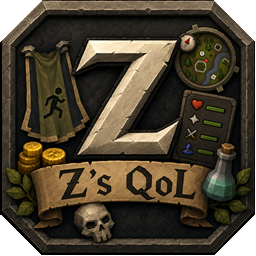

  

# Z's QoL

RuneLite plugin with six collapsible binding categories, each with
its own search bar:

- POH Teleporter / Portal Nexus
- Jewellery Box
- Quetzal Transport
- Fossil Island Mushtrees
- Spirit Trees
- Fairy Rings

Bindings are persisted with RuneLite's ConfigManager. Existing POH and
Jewellery Box bindings keep the same stable configuration keys when upgrading
from v3. New categories start unassigned.

For POH and transport menus, the plugin captures each destination while the
game creates the corresponding travel interface and directly resumes the
selected destination row. It does not require the destination to have a native
game hotkey.

Fairy Ring bindings are inactive unless the Fairy Ring Configure interface and
Travel Log are open. A binding locates the exact non-hidden Travel Log row by
code, destination text, and its existing `Use code` action, then invokes that
single existing component operation. The row may be outside the current scroll
viewport; no scroll action is generated. The plugin does not rotate individual
dials, write Fairy Ring varbits, click Teleport, retry, or display guidance.
The player must always click the game's Teleport button manually.

If the requested Travel Log row is hidden, filtered, or unavailable, the
binding silently does nothing.

Controls:

- Click a binding button and press a keyboard key or side mouse button.
- Escape cancels capture.
- Delete or Backspace clears the selected binding.
- The X button clears one row.
- Bindings only activate while the matching travel interface is open.
- An unavailable or locked destination silently does nothing.

Included destinations:

- 14 Quetzal landing sites
- 4 Fossil Island Mycelium/Mushtree destinations
- Permanent and player-grown Spirit Tree destinations

Keep Better Teleport Menu disabled while testing because both plugins control
some of the same interfaces.

## License

Z's QoL is licensed under the BSD 2-Clause License. See [LICENSE](LICENSE).
